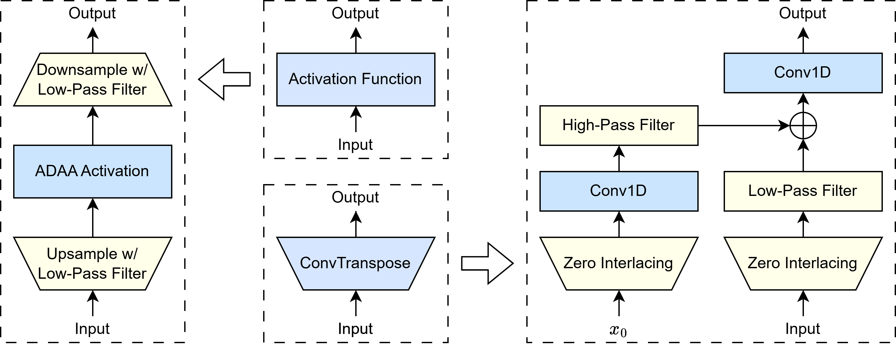
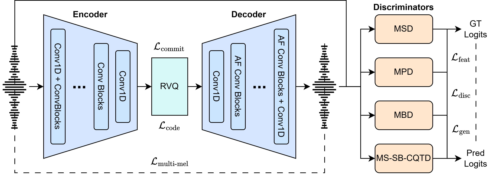

<p align="center">

</p>

<div align="center">

[](https://arxiv.org/abs/2512.20211)
[](https://www.yichenggu.com/AliasingFreeNeuralAudioSynthesis/)
[](https://huggingface.co/spellbrush/AliasingFreeNeuralAudioSynthesis)

</div>

# Aliasing-Free Neural Audio Synthesis

This is the official implementation of the paper "[Aliasing-Free Neural Audio Synthesis](https://arxiv.org/abs/2512.20211)", which is the first work to achieve simple and efficient aliasing-free upsampling-based neural audio generation in the entire field of neural vocoders and codecs. In particular, we apply oversampling and anti-derivative anti-aliasing to the activation function to obtain its anti-aliased form, and replace the problematic ConvTranspose layer with resampling to avoid the "mirrored" aliasing artifacts and "tonal artifact", as shown in the figure below:

<br>
<div align="center">

</div>
<br>

Based on our proposed anti-aliased module, we further introduce Pupu-Vocoder and Pupu-Codec, modified from [BigVGAN](https://arxiv.org/abs/2206.04658) and [DAC](https://arxiv.org/abs/2306.06546), and release high-quality pre-trained [checkpoints](https://huggingface.co/spellbrush/AliasingFreeNeuralAudioSynthesis) to facilitate audio generation research:

<br>
<div align="center">

</div>
<br>

This script provides an example of how to set up the environment, inference from our pretrained [checkpoints](https://huggingface.co/spellbrush/AliasingFreeNeuralAudioSynthesis), and train/finetune your own models with custom datasets.

> **NOTE:** You need to run every command of this recipe in the `AliasingFreeNeuralAudioSynthesis` root path:
> ```bash
> cd AliasingFreeNeuralAudioSynthesis
> ```

## 📀 Installation

```bash
git clone https://github.com/sizigi/AliasingFreeNeuralAudioSynthesis.git
cd AliasingFreeNeuralAudioSynthesis

# Install Python Environment
conda create --name afgen python=3.12
conda activate afgen

# Install Python Packages Dependencies
pip install -r requirements.txt
pip install descript-audiotools
```

## 🐍 Usage in Python

### 1. Data Preparation

By default, we utilize two datasets for training: Opencpop and VCTK. You can download the two datasets and specify their root directory in `dataset/train_example.json`:

```json
// TODO: Fill in the root directory
{
    "name": "VCTK",
    "path": "{PATH_TO_DATASET}/VCTK-Corpus-0.92/wav48_silence_trimmed"
},
{
    "name": "opencpop",
    "path": "{PATH_TO_DATASET}/2022-InterSpeech-Opencpop"
}
```

Our codebase supports file-based custom datasets. To add your own dataset, list out all the audio files in the dataset root directory and save them to `dataset/filelist/custom_dataset.json`:

```json
// TODO: List all the audio files in your dataset
[
    {
        "path": "{PARENT_FOLDER_TO_FILE}/{UID}.wav"
    },
    ... ...
    {
        "path": "{PARENT_FOLDER_TO_FILE}/{UID}.wav"
    }
]
```

After that, create a metadata file in `dataset/train_custom.json` to specify the datasets you want to utilize:

```json
// TODO: List all the datasets you want to utilize
{
"datasets":[
    {
        "name": "{CUSTOM_DATASET}",
        "path": "{PATH_TO_DATASET}/{CUSTOM_DATASET}"
    },
    ... ...
    {
        "name": "{CUSTOM_DATASET}",
        "path": "{PATH_TO_DATASET}/{CUSTOM_DATASET}"
    }
],

"filelist_path": "dataset/filelist"

}
```

### 2. Training

Adjust the `egs/exp_config_{model}_base.json` to specify the hyperparameters:

> **NOTE:** Our default configuration runs on NVIDIA H200/B200 GPUs. In many cases, you need to decrease the batch size, increase the number of training steps, and possibly set up `gradient_accumulate_steps` based on your GPU machine's capabilities.

```json
{
  ... ...
  // TODO: Choose your needed datasets, we use Opencpop and VCTK as the default
  "dataset": [
    "train_example",
  ],
  ... ...
  "train": {
    // TODO: Choose a suitable batch size, training epoch, and save stride
    "batch_size": 16,
    "max_epoch": 1000000,
    "save_checkpoint_stride": [1],
    ... ...
  }
}
```

Then, run the `egs/{model}/train_{model}.sh`. Specify an experimental name to run the following command. The tensorboard logs and checkpoints will be saved in `experiments/[YourExptName]`.

```bash
sh egs/{model}/train_{model}.sh --name [YourExptName]
```

> **NOTE:** The `CUDA_VISIBLE_DEVICES` is set as `"0"` in default. You can change it when running `run.sh` by specifying such as `--gpu "0,1,2,3"`.

If you want to resume or finetune from a pretrained model, run:

```bash
sh egs/{model}/train_{model}.sh \
	--name [YourExptName] \
	--resume_type ["resume" for resuming training and "finetune" for loading model parameters only (without optimizer and scheduler parameters)] \
	--checkpoint experiments/[YourExptName]/checkpoint \
```

> **NOTE:** For multi-gpu training, the `main_process_port` is set as `29500` in default. You can change it when running `run.sh` by specifying such as `--main_process_port 29501`.

### 3. Inference

Pretrained checkpoints, which use the same training set as the paper with more training steps, are released [here](https://huggingface.co/spellbrush/AliasingFreeNeuralAudioSynthesis).

By default, we provide two evaluation samples curated from Vocaloid soundbanks in `samples/`. You can construct your own evaluation sets using the same routine as creating custom training sets, as mentioned above.

Here is an example for the default scenario.

```bash
sh egs/{model}/inference_{model}.sh \
	--infer_datasets "inference_example" \
	--infer_expt_dir experiments/[YourExptName]/checkpoint \
	--infer_output_dir result/ \
```

## 🙏 Acknowledgement

- [Amphion](https://github.com/open-mmlab/Amphion) for project framework codebase.
- [BigVGAN](https://github.com/NVIDIA/BigVGAN) for training pipeline and model architecture design.
- [DAC](https://github.com/descriptinc/descript-audio-codec) for training pipeline and model architecture design.

## ©️ License

Our project is under the [MIT License](LICENSE). It is free for both research and commercial use cases.

## 📚 Citation

```bibtex
@article{afgen,
  title        = {Aliasing Free Neural Audio Synthesis},
  author       = {Yicheng Gu and Junan Zhang and Chaoren Wang and Jerry Li and Zhizheng Wu and Lauri Juvela},
  year         = {2025},
  journal      = {arXiv:2512.20211},
}
```
